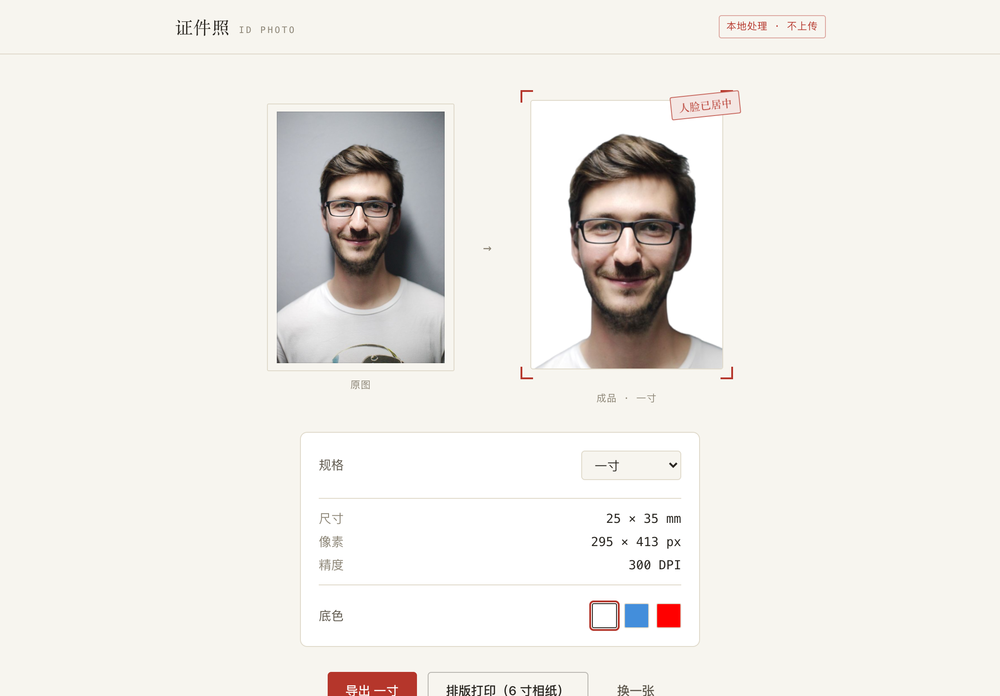
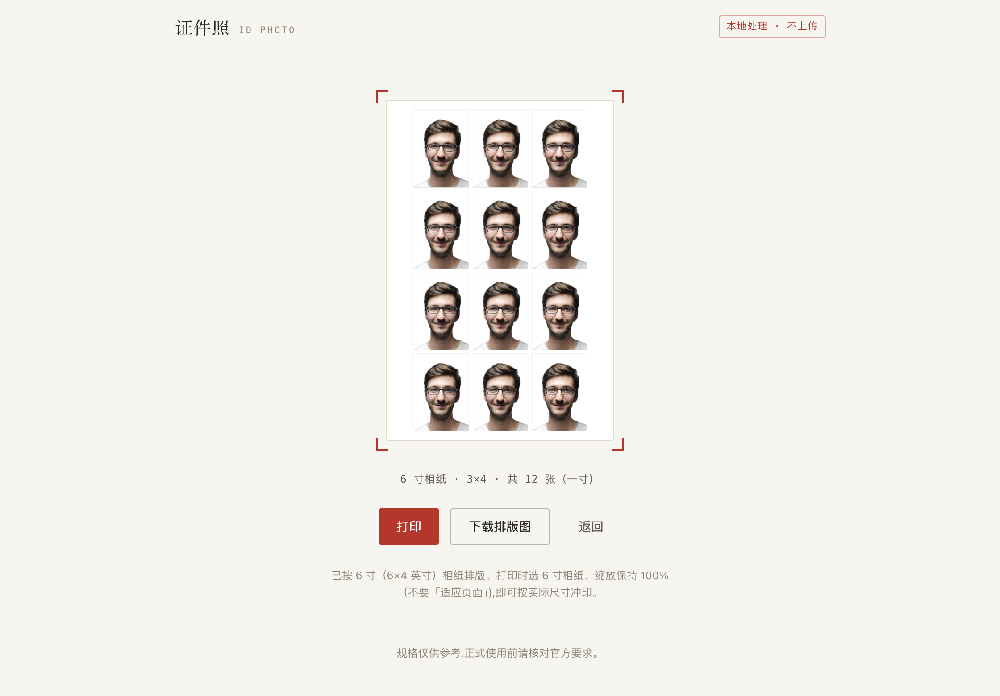

# 证件照工具

在浏览器里把随手拍变成合规证件照:自动抠图、按规格把人脸居中、换标准底色、导出精确像素,还能排到 6 寸相纸直接冲印。**整个过程都在你的浏览器本地完成,照片不会上传到任何服务器。**

🔗 在线使用:**https://kaelen2026.github.io/id-photo-app/**



## 为什么是它

市面上的在线证件照工具大多要把你的照片传到它们的服务器去处理。这个工具不一样:抠图模型和人脸检测都跑在你自己的浏览器里(WebGPU 加速,不支持时退回 WASM),照片从头到尾留在本地。代价是首次使用要下载一次 AI 模型(之后浏览器缓存、秒开),换来的是零服务器成本和真正的隐私。

## 功能

- **本地抠图** — 上传照片,自动去除背景
- **人脸自动居中** — 检测人脸,按所选规格控制头高占比和留白;认不出清晰人脸时退回默认排版
- **多规格** — 一寸、二寸、小一寸、居民身份证、护照、签证,导出精确到像素和 DPI
- **标准底色** — 白 / 蓝 / 红,按规格自动限定可选项
- **原图对照** — 处理前后并排,所见即所得
- **相纸排版** — 一键平铺到 6 寸相纸,正好一页、按真实尺寸打印或导出



## 工作原理

```
上传  →  RMBG-1.4 抠图        →  MediaPipe 人脸定位  →  Canvas 合成 + 导出  →  6 寸相纸排版
        (transformers.js,        (FaceLandmarker,       (换底色、按规格         (自动选朝向、
         WebGPU → WASM 兜底)       468 关键点)             精确像素导出)           细裁切线、单页打印)
```

- 图片只解码一次并显式套用 EXIF 朝向,抠图与人脸检测共用同一张正向位图,旋转的手机照片也不会裁歪。
- 模型权重首次从各 CDN 拉取后由浏览器缓存,二次访问无需重新下载。

## 技术栈

- **Vite + React + TypeScript + Tailwind** — 纯静态单页应用
- **[RMBG-1.4](https://huggingface.co/briaai/RMBG-1.4) via [transformers.js](https://github.com/huggingface/transformers.js)** — 浏览器端抠图(WebGPU 用 fp16,WASM 用 q8 以压缩首屏下载)
- **[MediaPipe FaceLandmarker](https://ai.google.dev/edge/mediapipe)** — 浏览器端人脸定位

## 本地运行

本应用是 infra-lab monorepo 的一个 workspace 成员(`@infra/id-photo`),依赖由仓库根统一安装:

```bash
pnpm install                              # 在仓库根执行一次
pnpm dev:id-photo                         # http://localhost:3004/id-photo-app/
pnpm --filter @infra/id-photo build       # 产物在 apps/id-photo/dist/
pnpm --filter @infra/id-photo preview     # 预览生产构建
```

抠图依赖 WebGPU(Chrome / Edge 113+ 默认开启)以获得最佳速度,不支持时自动退回 WASM。首次使用会下载模型,留意进度条。

## 部署

迁入 monorepo 后**尚未配置部署**。构建产物在 `apps/id-photo/dist/`(纯静态,可托管到任意静态站点)。
`vite.config.ts` 的 `base` 仍为 `/id-photo-app/`,正式接入某个托管路径时需据此调整
(并同步 `index.html` 里的 canonical / OG URL)。

## 说明与限制

- 各规格的尺寸为通用实践值,头高占比为近似值,正式使用前请核对官方要求。
- RMBG-1.4 为**非商用**许可,本项目仅用于学习与作品集。
